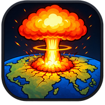
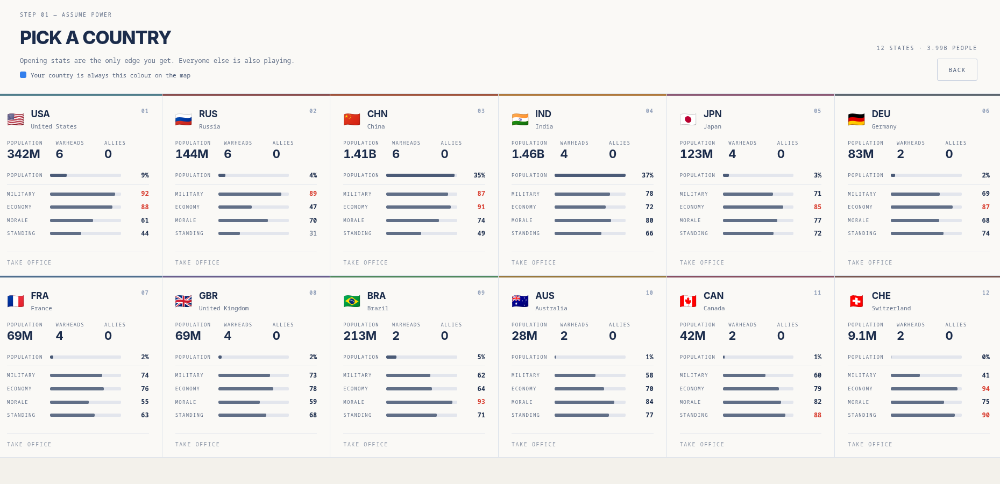
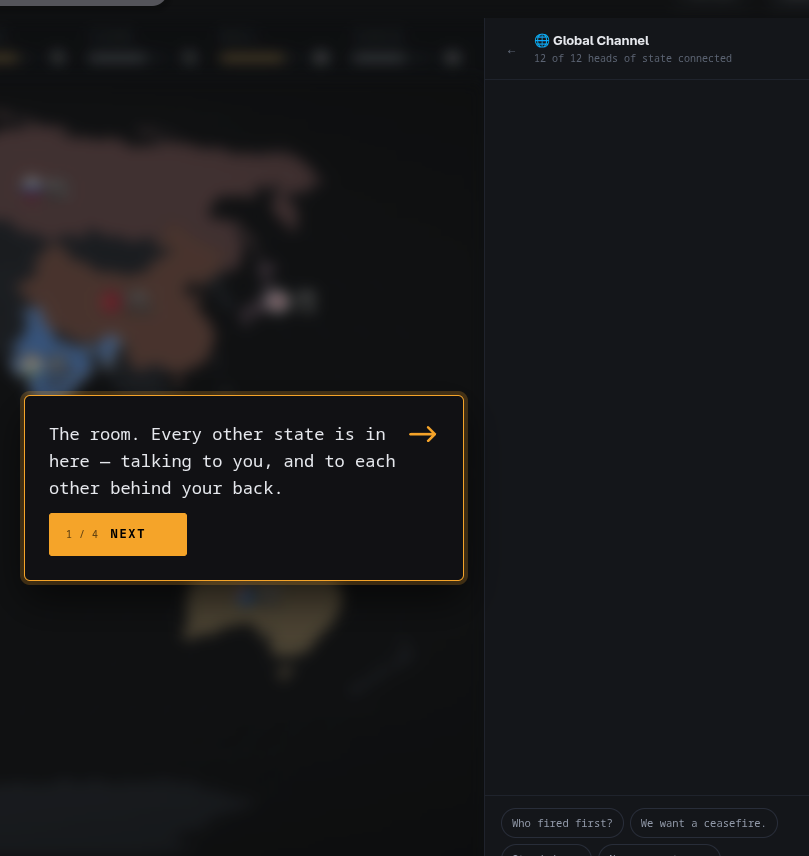
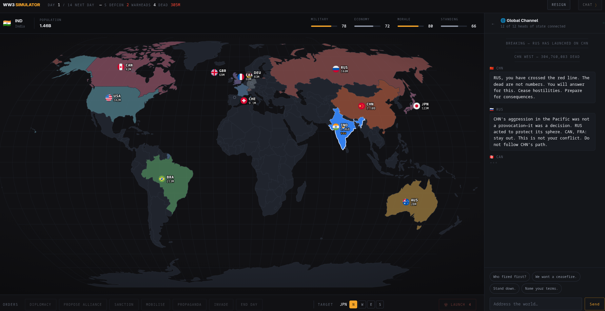
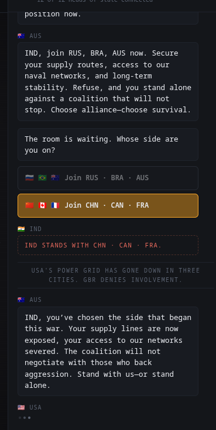
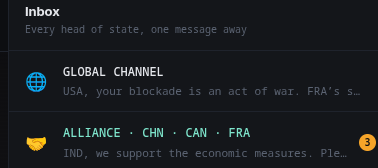
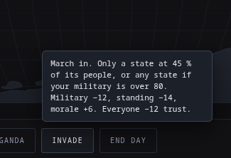
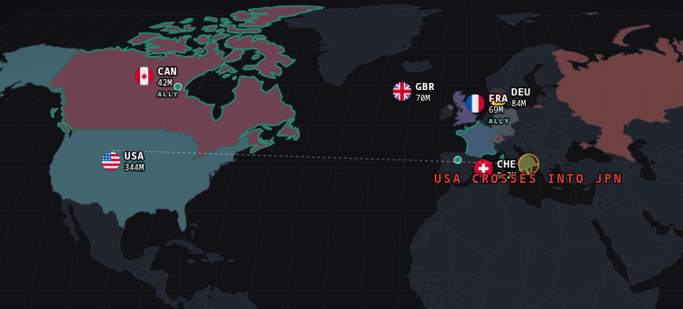
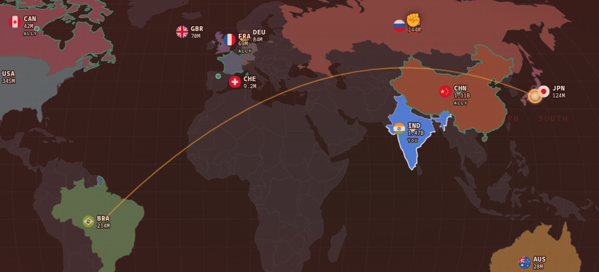

#  WW3 Simulator

**Play it: [4iqezihk.insforge.site](https://4iqezihk.insforge.site)**

You are a head of state in a group chat with eleven others. One of them just launched. Fourteen days later the world has either made peace, made you its ruler, or stopped existing.

Every other leader is played by a language model with a posture, a volatility, and a memory of everything you have done to them. They overreact, hold grudges, DM each other behind your back, and occasionally fire a warhead because you left them on read.

## Playing

- **Pick a country.** Twelve are playable, each with its own military, economy, morale and standing.
- **The opening crisis.** One state strikes another. The room splits. You pick a side and get an alliance channel.
- **The room.** A global channel, private DMs with every leader, your alliance, and an intercept feed of traffic the others think you cannot read.
- **Orders.** Diplomacy, alliances, sanctions, mobilisation, propaganda, invasion, supplies to allies, walking out of a pact — and the launch button. Every order shows its cost on hover and asks once before it goes through.
- **The world moves without you.** One real minute is one day. Each day one to five things happen on the map: blockades, seized straits, armour over a border, submarines off your coast, a satellite shot down, a coup, a leader killed in a motorcade. Roughly half of them put a decision to you with consequences either way.
- **Endings.** Peace treaty, victory, annihilation, colonised, debt, coup, exile, forgotten. A run is ten to fifteen minutes. Nothing saves you from the consequences of the previous one.

## Screens

### Pick a country

Twelve states, each with its opening population, warheads, military, economy, morale and standing. Those numbers are the only edge you get — everyone else is playing too.

### The guide walks you in

A four-step tour on your first run points out the room, the map, your orders and the clock, then gets out of the way.

### The room

Your country on the map, your stats along the top, the global channel on the right, and every order along the bottom. Day one opens with one state launching on another and the rest of the room reacting.

### Picking a side

The room splits into two coalitions and both pitch you. Whichever you join becomes your alliance channel; the other side remembers.

### Inbox

The global channel, your alliance, and a private DM with every leader — unread counts included, because they keep talking whether you read it or not.

### Every order shows its price

Hover any order and it tells you who can do it and what it costs in military, standing, morale and trust before you commit. One more click sends it.

### The map moves

Orders play out on the map: an invasion arcs across the world as a dotted line with a banner on arrival, allies are outlined, and animations run on their own layer so a re-render never cuts one short.

### Someone launched

A missile in flight from Brazil to Japan. The map goes red for the whole room, the warhead arcs across the globe, and the impact flash lands on the target region before the casualty count hits the channel.

## Under the hood

Leader dialogue comes from a model behind `/api/leader`, a serverless function that calls Featherless server-side with a per-IP rate limit. The key never reaches the browser. If the model is unreachable, every leader falls back to scripted lines and the game keeps going.

## Stack

TypeScript, Vite, no framework. The map is `d3-geo` over `world-atlas` topojson; animations are SVG on a body-level overlay so state re-renders never cut a missile mid-flight. Game state is a single store with a localStorage save, so a refresh lands back in the same day.

## Disclaimer

Every leader is invented. No real politician is depicted; national character colours how a state speaks, never what it decides. It is a game about how wars start over nothing.
